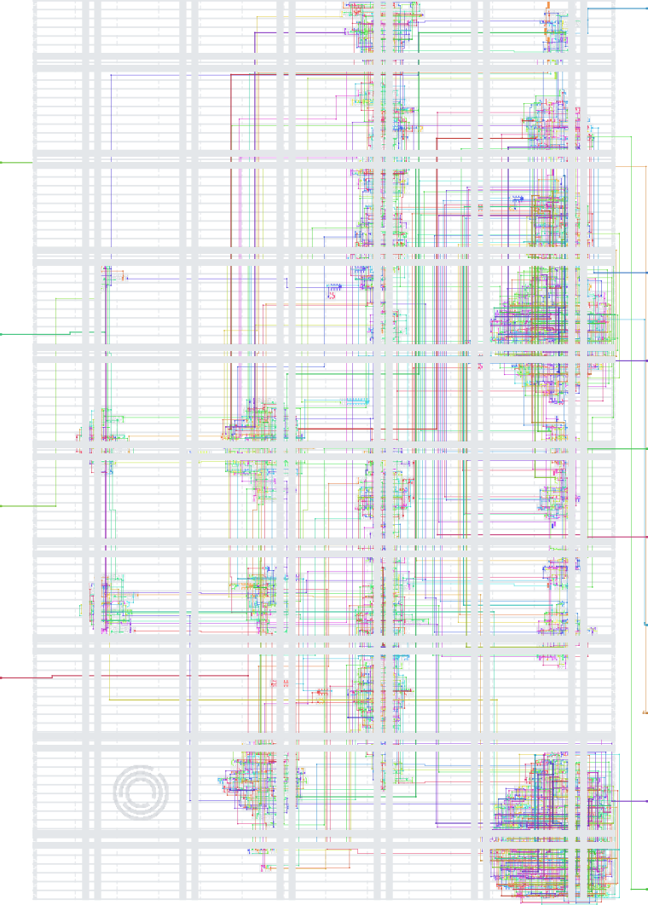
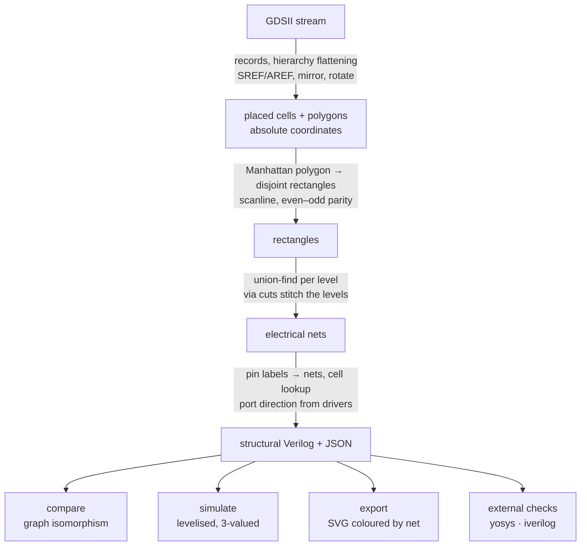
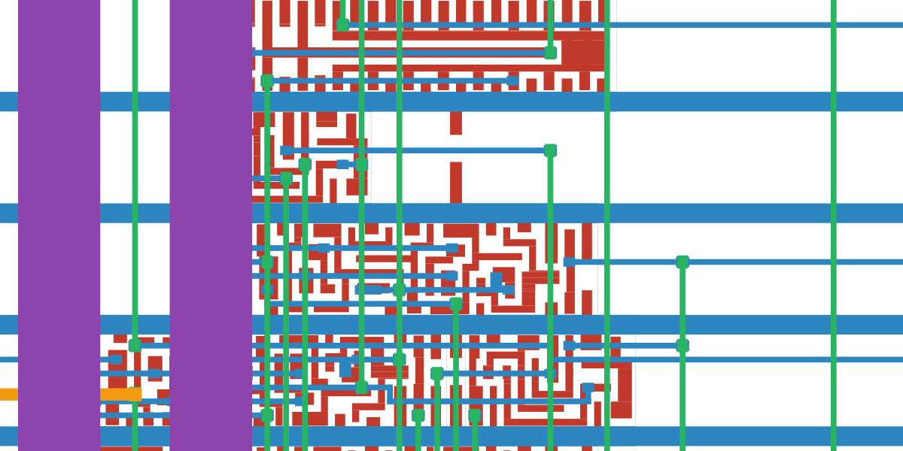
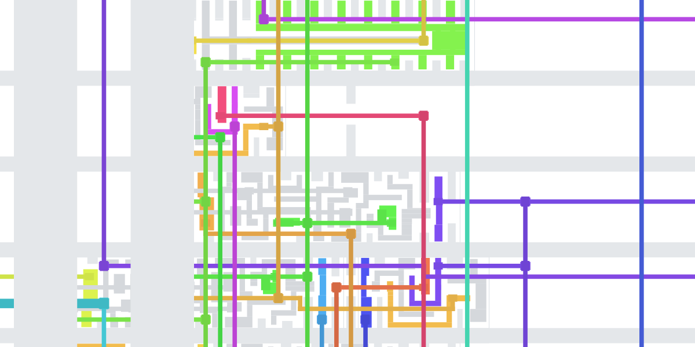
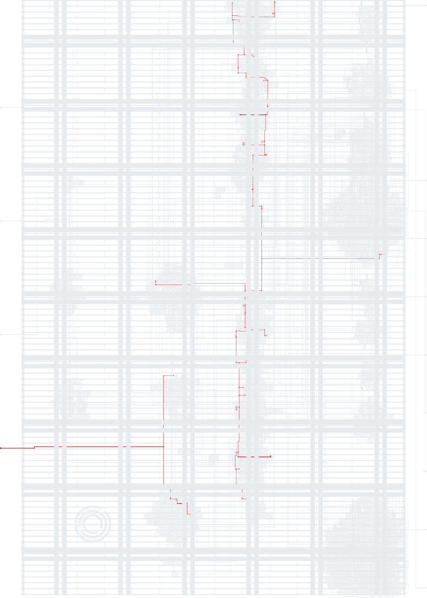
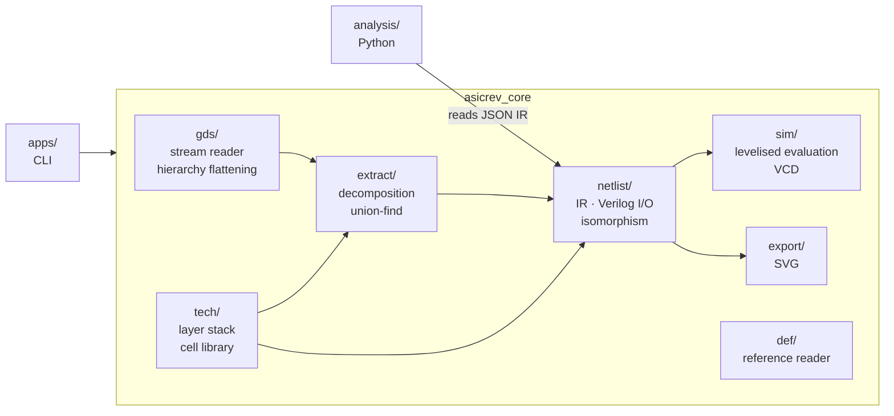
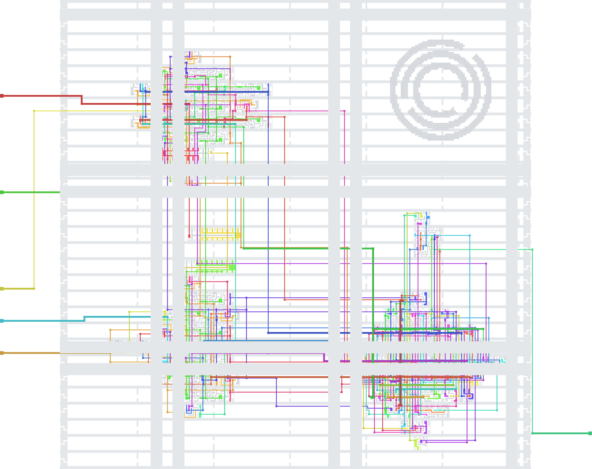

# asicrev

**Recover a gate-level netlist from a finished GDSII layout — and prove the
recovery is correct.**

A manufactured chip ships as polygons on mask layers. Every name its designer
wrote is gone, because the format has nowhere to keep them: there are no
modules, no wires, no signals, no functions — only rectangles on numbered
layers, plus a flat list of text labels that happen to sit on top of some of
them. `asicrev` reads that file and reconstructs the circuit — cells, nets,
ports, function — then checks itself against every reference it can find, up to
formal equivalence.

C++20, no EDA dependencies. Builds from a bare checkout with a compiler and
CMake.

```
puzzle.gds ──▶ 1 618 placements, 130 137 polygons ──▶ 728 logic cells, 739 nets
                                                       60 ms, 0 warnings
```

> **Two layouts appear throughout this README, and it matters which is which.**
> Every section below is tagged with the one it is about. See
> [The two layouts](#the-two-layouts) — read that first if a figure or a number
> ever looks like it belongs to the other design.

<p align="center">
  
</p>

*`external/janestreet-asic-puzzle/puzzle.gds`, coloured by the electrical node
`asicrev` assigned to each piece of metal. Supplies are grey; every other colour
is one of the 739 recovered nets. Nothing in this picture was read from a
netlist — it is the extraction's own opinion, drawn back onto the geometry that
produced it.*

---

## The two layouts

Both are vendored in [`external/janestreet-asic-puzzle/`](external/janestreet-asic-puzzle/),
so nothing has to be fetched. They are the same silicon process and the same
design flow, and they differ in exactly one respect: for one of them the answer
is published, and for the other nothing is.

| | **the warm-up** | **the target** |
| --- | --- | --- |
| File | `warmup/04_final.gds` | `puzzle.gds` |
| Size | 306 kB · 230 placements · 79 logic cells | 1 422 kB · 1 618 placements · 728 logic cells |
| Also ships with | source, synthesized netlist, routed database | one recorded waveform, and nothing else |
| Its role here | **the test rig** — every claim the tool makes can be scored against a known-good answer | **the actual job** — no reference of any kind exists to check against |
| What it computes | `S ⇔ (A + B == 496)` | unknown at the start; recovered as an 11×11 Star Battle checker |
| Script | `./scripts/demo.sh` | `./scripts/solve.sh` |

**Why both are here.** A faulty extractor and a correct one are
indistinguishable by inspection — both emit plausible Verilog with no warnings.
So the warm-up is not a tutorial, it is the instrument calibration: the tool is
driven to formal equivalence there, where being wrong is *detectable*, and only
then pointed at `puzzle.gds`, where being wrong would be silent. Every number in
[Verification § A](#verification-a) exists to make the numbers in
[Verification § B](#verification-b) believable.

From here on, every section carries a tag:

- **`[warm-up]`** — about `warmup/04_final.gds`
- **`[target]`** — about `puzzle.gds`
- **`[both]`** — about the tool itself, independent of either

---

## Quick start &nbsp;`[both]`

```sh
./scripts/bootstrap.sh          # Ubuntu/Debian deps  (--all adds yosys, iverilog, klayout)
cmake --preset default
cmake --build build/default
ctest --test-dir build/default  # 42 tests

./scripts/demo.sh               # [warm-up] validate the method   (~1 min)
./scripts/solve.sh              # [target]  layout to answer      (~1 min)
```

Two guided scripts, both stepping through one command at a time and saying what
each is for. Everything they write goes to `work/`, which is git-ignored; press
enter between steps, or set `PAUSE=0` to let them run through.

| | Runs on | What it is for |
| --- | --- | --- |
| **`demo.sh`** | `[warm-up]` | Extraction is compared against the routed database, proven graph-isomorphic to the reference netlist, proven equivalent by an external SAT checker, then simulated. **This is the script that establishes the tool is correct.** |
| **`solve.sh`** | `[target]` | Extract, read the registers out of the flip-flop equations, measure what cannot be read, solve, and print what the chip says. **This is the script that gets the answer.** |
| **`prove_rtl.sh`** | `[target]` | Proves the recovered RTL equivalent to the extracted gates by bounded model checking. Takes a depth argument; the default is complete and slow. |

Either script also takes a path, so any sky130 layout works. Other process kits
need a layer stack in `src/tech/sky130.cpp` and their cells in
`src/tech/std_cells.cpp`.

```sh
./scripts/demo.sh  path/to/dir-containing-04_final.gds
./scripts/solve.sh path/to/some.gds
```

---

## What it does &nbsp;`[both]`



Only the GDSII is ever an input. Reference files are read **exclusively to score
the result**, never to produce it.

One 22 × 11 µm window of `warmup/04_final.gds`, before and after that pipeline —
the same rectangles both times:

| what is in the file | what the extractor concluded |
| --- | --- |
|  |  |
| Rectangles on numbered layers. Red is li1, blue met1, green met2, purple met3; the dots are via cuts. No signal exists yet — this is what the format actually stores. | The identical rectangles, recoloured by the electrical node each one ended up in. Every colour boundary here is a claim: *these two pieces of metal are not the same wire.* |

*The warm-up design is used for this pair rather than `puzzle.gds` because it is
small enough that a single window shows whole cells. Both go through the same
code path.*

### The two things that decide correctness &nbsp;`[both]`

Most of the pipeline is bookkeeping. Two properties decide whether the output is
right or merely plausible — and both failure modes produce a netlist with the
right cell count, the right net count, no warnings, and the wrong function.

**1. Polygons must be cut exactly, not bounding-boxed.**

```
   ┌───────────────┐          the bounding box of an L-shaped pin
   │ ▓▓▓           │          covers area the metal never occupies,
   │ ▓▓▓   ┌───────┼──┐       so a wire crossing that area is merged
   │ ▓▓▓   │ other │  │       into the pin's net
   │ ▓▓▓▓▓▓┼───────┼──┘       →  false short, silently
   │ ▓▓▓▓▓▓▓▓▓▓▓▓▓ │
   └───────────────┘          scanline slabs → exact, no false overlap
```

A scanline over the distinct y coordinates cuts each rectilinear polygon into
slabs; within a slab the vertical edges pair up by parity. Adjacent slabs with
identical spans are merged back, so a tall wire doesn't explode into one
rectangle per scanline. `warmup/04_final.gds` alone contains 108 non-rectangular
conductor polygons — this is not a corner case.

**2. A via conducts on _overlap_, not on _adjacency_.**

Abutting metal on the same level is one wire, so same-level merging uses a touch
test. Reusing that test for vias shorts any two nets whose geometry abuts the
same via boundary — which happens whenever a via sits at the end of a wire next
to another track. Cuts require strictly positive overlap area.

---

## Running it, step by step &nbsp;`[warm-up]` then `[target]`

The two scripts are the fast path. This section is the same route by hand, so
the shape of the method is visible rather than scripted away. Every command
writes into `work/`; nothing outside it is touched.

```sh
D=external/janestreet-asic-puzzle          # the vendored layouts
B=build/default/asicrev                    # the binary
mkdir -p work
```

### Stage 1 &nbsp;`[warm-up]` — establish the tool is right, where the answer is known

The warm-up design ships with its full flow: source, synthesized netlist, routed
database, final layout. Extraction reads *only* the last one; the other three
exist to disagree with it.

```sh
# 1. What is even in this file? Which layers, which cells, how deep?
$B inspect $D/warmup/04_final.gds --layers --cells
```
> The only question that matters here: **did the library cell names survive?**
> They did. That makes this a geometry problem. Had they been stripped, it would
> be transistor-level device recognition, a different and much larger project.

```sh
# 2. Geometry to netlist.
$B extract $D/warmup/04_final.gds \
    -o work/netlist.v --json work/netlist.json --stubs work/models.v
```
> Watch the four counters in the summary — unbound pin labels, split pins,
> unknown cells, warnings. All four are zero. They are the extractor's own
> statement that it accounted for every pin of every cell it placed.

```sh
# 3. Look at what it decided, before believing any number it printed.
$B export $D/warmup/04_final.gds -o work/nets.svg --colour net --dim-power
```
> Open it in a browser. A net that renders as scattered confetti instead of a
> connected tree means the merge is wrong. Cheapest check in the project.

```sh
# 4. Same circuit as the reference, up to renaming?
$B compare work/netlist.v $D/warmup/01_netlist.v \
    --mapping --write-renamed work/netlist_named.v
```
> This is a graph isomorphism on the instance/net bipartite graph. *Zero
> backtracks* means colour refinement alone separated every node — the recovered
> topology is rigid, not merely compatible.

```sh
# 5. Same placement and connectivity as the routed database?
$B extract $D/warmup/04_final.gds -q --physical --power \
    --stubs work/models_all.v --check-def $D/warmup/03_post_place_and_route.def
```
> 230/230 components at the same position, 84/84 nets with identical pin sets.

```sh
# 6. Formal equivalence, checked by a tool that shares none of our code.
yosys -p "read_verilog work/models_all.v work/netlist_named.v; prep -flatten -top adder_demo; async2sync; design -stash gold
          read_verilog work/models_all.v $D/warmup/01_netlist.v; prep -flatten -top adder_demo; async2sync; design -stash gate
          design -copy-from gold -as gold adder_demo; design -copy-from gate -as gate adder_demo
          equiv_make gold gate equiv; hierarchy -top equiv; equiv_simple -seq 4; equiv_induct; equiv_status -assert"
```
> Step 4's `--write-renamed` is what makes this work: without a name mapping
> `equiv_make` can only pair the ports, and the proof silently collapses to
> nothing.

```sh
# 7. So what does the thing compute? Ask the netlist, don't read the source.
$B sim work/netlist.v --clock clk --reset rst_n --drive en=1 \
    --serial A --serial B --bits 8 --target S
```
> 15 input pairs drive `S` high, and every one satisfies `A + B == 496`.
> Only now is it fair to open `00_source.v` and see that it says exactly that.

### Stage 2 &nbsp;`[target]` — point it at `puzzle.gds`, where nothing is known

Same first three commands, different file, and from there nothing can be
compared against anything.

```sh
$B inspect $D/puzzle.gds --cells
$B extract $D/puzzle.gds -o work/puzzle.v --json work/puzzle.json --stubs work/models.v
$B export  $D/puzzle.gds -o work/puzzle_nets.svg  --colour net --dim-power
$B export  $D/puzzle.gds -o work/puzzle_input.svg --highlight I --no-instances
```



`puzzle.gds`: 1 618 placements, 130 137 polygons, 728 logic cells, 739 nets,
extracted in 60 ms with zero warnings.

On the right is the last of those four commands — `--highlight I` draws the
serial input alone, in red, across every level it uses, with the rest of the die
greyed out. That red spine is *one* net. This is how you check by eye that one
*logical* signal really is one *physical* conductor, rather than several that a
sloppy merge glued together or one that a strict merge tore apart.

Gates are not yet a design. The next step turns 728 cells into something a human
can read:

```sh
# 8. Flip-flop equations -> registers -> RTL.
python3 analysis/recover_rtl.py work/puzzle.json work/puzzle_rtl.v
```
> Every flop's next-state function is expanded symbolically, and the register
> roles are read out of the resulting algebra: counter moduli from the decode
> terms, bit weights from the carry chain, shift-register taps from the
> `q[i]' = q[j]` chain, accumulator targets from the conjunction driving the
> output. Where synthesis had minimised eleven arbitrary membership functions
> into one shared unreadable mess, the answer is to stop reading and *measure*:
> set one input bit, run, see which counter reacts, repeat.

```sh
# 9. Solve the recovered constraints, feed the solution back in, read the bus.
python3 analysis/solve_puzzle.py work/puzzle.json
```
> The netlist is treated as an oracle: the solution is not asserted, it is
> clocked back into the extracted gates and the output is whatever they say.

```sh
# 10. Does the recovered RTL agree with the gates it came from?
#     A small adapter first, because the two have different port shapes:
cat > work/gate_wrap.v <<'EOF'
module gate_wrap (input clk, input rst_n, input enable, input I, output success);
  wire [7:0] o;
  puzzle dut (.clk(clk), .rst_n(rst_n), .enable(enable), .I(I), .success(success),
    .\O[0] (o[0]), .\O[1] (o[1]), .\O[2] (o[2]), .\O[3] (o[3]),
    .\O[4] (o[4]), .\O[5] (o[5]), .\O[6] (o[6]), .\O[7] (o[7]));
endmodule
EOF
iverilog -g2012 -o work/equiv.vvp \
    work/models.v work/puzzle.v work/puzzle_rtl.v work/gate_wrap.v verilog/tb_equiv.v
vvp work/equiv.vvp
```
> Both sides are simulated against each other on the solution, the degenerate
> grids, and 200 pseudo-random ones, by a simulator neither of them came from.
> The bar is zero differing cycles.

```sh
# 11. Does any of it match the real chip?
python3 analysis/replay_vcd.py work/puzzle.json $D/example_inputs.vcd
```
> The recording came from the original design and was never an input to
> extraction, so agreement is a statement about the recovered model rather than
> about our own assumptions. 312 clock edges, 624 sampled values, zero
> mismatches — and the extracted netlist prints the same message the real chip
> did.

```sh
# 12. And the same claim as a proof rather than as simulation.
./scripts/prove_rtl.sh 20      # smoke test, seconds
./scripts/prove_rtl.sh         # complete: 3.2 M clauses, ~5.5 hours
```

<br clear="all">

### What gets written &nbsp;`[both]`

A full run of `demo.sh` followed by `solve.sh` leaves 16 files in `work/`
(~14 MB). All of them are regenerated from the layouts on every run and all are
git-ignored.

| File | Written by | What it is |
| --- | --- | --- |
| `netlist.v` · `puzzle.v` | `extract` | the recovered structural Verilog — the actual product |
| `netlist.json` · `puzzle.json` | `extract` | the same netlist as IR, for the Python layer |
| `models.v` · `models_all.v` | `extract --stubs` | behavioural cell models, so external tools can elaborate the above |
| `netlist_named.v` | `compare --write-renamed` | the extraction rewritten with the reference's names |
| `puzzle_rtl.v` | `recover_rtl.py` | behavioural RTL reconstructed from the gate netlist |
| `gate_wrap.v` | `solve.sh` | port adapter so RTL and gates can be compared |
| `nets.svg` · `layers.svg` | `export` | renders of `warmup/04_final.gds` |
| `puzzle_nets.svg` · `puzzle_input.svg` | `export` | renders of `puzzle.gds` |
| `trace.vcd` | `sim --vcd` | waveform from our own simulator |
| `sweep.vvp` · `equiv.vvp` | `iverilog` | compiled independent testbenches |

---

## Commands &nbsp;`[both]`

| | |
| --- | --- |
| `asicrev inspect <gds>` | what the file contains: layers, cells, labels, hierarchy |
| `asicrev extract <gds>` | geometry → netlist; emits Verilog, JSON IR and cell models |
| `asicrev compare <a.v> <b.v>` | are two netlists the same circuit up to renaming? |
| `asicrev sim <netlist.v>` | simulate, trace to VCD, or search the inputs |
| `asicrev export <gds>` | render the layout coloured by recovered net |

```sh
# What am I looking at?
asicrev inspect design.gds --layers --cells

# Geometry to netlist. --power/--physical keep the rails and fillers.
asicrev extract design.gds -o netlist.v --json ir.json --stubs models.v

# ...and score it against a routed database, if you happen to have one
asicrev extract design.gds -q --physical --power --check-def reference.def

# Same circuit as the reference? --write-renamed hands back the original names
asicrev compare netlist.v reference.v --mapping --write-renamed named.v

# Trace it, or search its inputs for one that drives an output high
asicrev sim netlist.v --clock clk --reset rst_n --drive en=1 \
    --seq A=11111111 --seq B=11110001 --cycles 10 --vcd trace.vcd
asicrev sim netlist.v --clock clk --reset rst_n --drive en=1 \
    --serial A --serial B --bits 8 --target S

# Draw it. --highlight traces one net across every level it uses.
asicrev export design.gds -o nets.svg --colour net --dim-power
asicrev export design.gds -o cells.svg --colour layer --max-level 1
asicrev export design.gds -o one_net.svg --highlight clk
```

`export` is the cheapest sanity check in the project: a net that renders as
scattered confetti instead of a tree means the merge is wrong.

---

## Modules &nbsp;`[both]`



| Path | What it is |
| --- | --- |
| `src/gds/` | GDSII record reader and hierarchy flattening. Reals are IBM excess-64, *not* IEEE 754 — a reader that assumes otherwise silently mis-scales every coordinate. |
| `src/extract/` | Polygon → rectangle decomposition, a uniform grid index, and the union-find that turns geometry into nets. |
| `src/tech/` | The layer stack (li1 + met1–5, five via layers) and ~70 sky130 cells with pin lists and Boolean functions. |
| `src/netlist/` | Netlist IR, structural Verilog reader and writer, JSON dump, and the graph-isomorphism comparison. |
| `src/sim/` | Levelised zero-delay simulator, three-valued (0/1/x), plus a VCD writer. |
| `src/export/` | SVG rendering of extracted geometry, coloured by net or by mask level. |
| `src/def/` | Reader for a routed database. Used **only** to score results, never as an input. |
| `apps/` | The `asicrev` binary; one file per subcommand. |
| `analysis/` | Python on top of the JSON IR: compile a netlist to straight-line code, solve recovered constraints, recover RTL. |
| `verilog/` | Testbenches the scripts use to re-run results under an independent simulator. |
| `external/` | Vendored input data — both layouts and the warm-up's reference files. Never modified, never an output. |
| `docs/img/` | Figures used by this README, with the commands that regenerate them. |
| `tests/` | 42 cases, including an end-to-end run of a full design inside `ctest`. |

Design notes for each module: [docs/modules.md](docs/modules.md).

---

## Verification

The point of this project isn't the extractor, it's that the extractor is
*checked*. A reverse-engineering result is normally an artefact plus an
argument; here it's an artefact plus a chain of proofs, all asserted by `ctest`
so a regression fails the build.

The chain has two links, and they answer different questions. **§ A** asks *is
this tool trustworthy?* and can be answered absolutely, because the warm-up has
an answer key. **§ B** asks *is this particular result right?* and has no answer
key at all — so it leans on § A for the tool, and adds every check that does not
need a reference.

<a name="verification-a"></a>

### A — what the warm-up establishes about the tool &nbsp;`[warm-up]`

Against `warmup/04_final.gds`, the one layout that ships with its full flow
(source → synthesized netlist → routed database → final layout), so every row
here has something real to be wrong against:

<p align="center">
  
</p>

*`warmup/04_final.gds`, 79 logic cells and 84 nets, coloured the same way as the
picture at the top of this page. Every one of these nets was matched, pin for
pin, against the routed database and the reference netlist.*

| Check | Result |
| --- | --- |
| Logic cells / signal nets recovered | 79 / 79 · 84 / 84 |
| Unbound pin labels · split pins · unknown cells | 0 · 0 · 0 |
| Placement vs the routed database | **230 / 230** components at the same position |
| Connectivity vs the same database | **84 / 84** nets with identical pin sets |
| Graph isomorphism vs the reference netlist | **proven**, 0 backtracks |
| Same, including power rails and fillers | **proven** |
| Formal equivalence (yosys SAT) | **380 / 380 nodes proven** |
| Recovered function | `S ⇔ (A + B == 496)`, matching the published description |

> A routed database records a cell's position as the lower-left of its
> **abutment box after orientation**; a layout records the cell's **own origin**.
> For the flipped rows of a standard-cell layout these differ by the row height.
> Comparing raw coordinates scores 96/230 and looks like a serious extraction
> bug. It was a bug in the checker. Verification harnesses need their own
> scrutiny.

**What § A buys.** Not that the answer in § B is right — the two designs are
different files. What it buys is that the *machinery* producing that answer has
been driven to formal equivalence on a design of the same process, from the same
flow, through the identical code path, with no special-casing between them. The
extractor cannot tell which file it is reading.

<a name="verification-b"></a>

### B — what is established about `puzzle.gds` &nbsp;`[target]`

No source, no netlist, no routed database. Everything below is either internal
consistency or a comparison against the one artefact the vendor did publish — a
recorded waveform that was never an input to extraction.

| Check | What it can rule out | Result |
| --- | --- | --- |
| Extraction self-report: unbound pin labels · split pins · unknown cells · warnings | the extractor quietly not understanding part of the file | **0 · 0 · 0 · 0** across 1 618 placements |
| Replay of the vendor's `example_inputs.vcd` through the extracted netlist | the recovered gates being the wrong circuit | **624 / 624** sampled values of `O` and `success` over 312 clock edges, **0 mismatches** — and it prints the same `TRY AGAIN` the real chip did |
| Recovered RTL vs extracted gates, under iverilog (`tb_equiv`) | the human-readable reconstruction drifting from the gates it came from | **0 differing cycles** on the solution, both degenerate grids, and 200 pseudo-random ones |
| Same claim as a proof: miter + BMC in yosys, depth 128 | the above three agreeing only on the inputs that happened to be tried | **no counterexample**, 1 209 641 vars / 3 207 542 clauses, 332 min |
| Solution uniqueness | the recovered constraints admitting more than one grid | the recovered 11×11 Star Battle has **exactly one** solution |
| Feeding that solution back through the extracted gates | the answer being asserted rather than obtained | `success` goes high, `O` spells **`(* TWO STARS *)`** |

> The BMC bound of 128 is *complete*, not merely deep. The design is a
> straight-line scan of 121 cells that latches `done` on the last one and then
> ignores its input forever, so no reachable behaviour lies outside 121 cycles.
> Anything below that depth would be evidence; 128 is a proof.

Reproduce the whole of § B in about a minute:

```sh
PAUSE=0 ./scripts/solve.sh      # ends at (* TWO STARS *)
./scripts/prove_rtl.sh          # the depth-128 row, ~5.5 h
```

### Scale &nbsp;`[both]`

| | `warmup/04_final.gds` `[warm-up]` | `puzzle.gds` `[target]` |
| --- | ---: | ---: |
| GDSII size | 306 kB | 1 422 kB |
| placements · logic cells | 230 · 79 | 1 618 · 728 |
| polygons → rectangles | 17 871 → 10 151 | 130 137 → 72 500 |
| pin labels bound | 1 007 | 8 400 |
| signal nets · ports | 84 · 8 | 739 · 15 |
| unbound · split · unknown · warnings | 0 · 0 · 0 · 0 | 0 · 0 · 0 · 0 |
| wall time · peak RSS | 10 ms · 11 MB | 60 ms · 39 MB |

~2.2 M polygons/second including parsing; no super-linear behaviour across the
7.3× jump in polygon count.

---

## From netlist to design &nbsp;`[target]`

Extraction stops at gates. `analysis/recover_rtl.py` goes further: it expands
every flip-flop's next-state function symbolically, reads the register roles out
of the resulting algebra, and emits behavioural Verilog.

```
q39' = ~( (~q39 & ~q37 & q38 & q40) | ~(q39 ^ (~q36 & enable)) )   // extracted
     = ~(col == 10) & (q39 ^ step)                                  // recognised
```

That is bit 0 of a modulo-11 counter, and the modulus is the first real fact
about the design. Bit weights come from the carry chain, shift-register taps
from the `q[i]' = q[j]` chain, accumulator widths and their target constants
from the conjunction driving the output. Where the algebra becomes unreadable —
synthesis had minimised eleven arbitrary membership functions into one shared
mess — the answer is to stop reading and measure instead: perturb one input bit
at a time and record which state bits react.

```sh
asicrev extract design.gds --json work/ir.json
analysis/recover_rtl.py  work/ir.json work/design_rtl.v   # equations -> RTL
analysis/solve_puzzle.py work/ir.json                     # solve, feed back, read the output
analysis/replay_vcd.py   work/ir.json recording.vcd       # check against a real recording
```

The reconstruction is then checked against the gates it came from: identical on
every observed signal across 203 simulated inputs, and **proven equivalent** by
bounded model checking to a depth of 128 cycles. That bound is complete rather
than merely deep — the design is a straight-line scan of 121 cells that latches
`done` on the last one and then ignores its input, so every reachable behaviour
falls inside it.

```sh
./scripts/prove_rtl.sh 20     # smoke test, seconds
./scripts/prove_rtl.sh        # the full proof: 3.2 M clauses, ~5.5 hours
```

---

## Limitations &nbsp;`[both]`

- **Cell identity is a lookup.** Both designs studied kept their library cell
  names. Stripped names would need leaf cells classified by geometry (tractable
  — a cell's geometry is a perfect fingerprint); a fully flattened layout would
  need transistor-level recognition, which is a much bigger job.
- **Body terminals are inferred, not extracted.** `VPB`/`VNB` are labelled on
  the n-well and substrate, which no metal trace reaches. Doing it honestly
  needs device recognition. In this PDK they are always tied to the cell's own
  rails, so `extract --power` fills them in and **reports the count**.
- **Input search is exhaustive.** Refuses spaces beyond 2²⁶. Larger instances
  want SAT/BMC — the emitted Verilog is already the right interface.
- **Timing is ignored.** Extraction is topological. The netlist is functionally
  faithful and says nothing about whether the silicon meets timing.

---

## Development &nbsp;`[both]`

```sh
cmake --preset asan                                # Debug + ASan/UBSan
cmake --build build/default --target format        # clang-format the tree
cmake --build build/default --target format-check  # verify, for CI
```

Presets: `default` (RelWithDebInfo + tests), `release`, `asan`. The full warning
set is on, including the conversion warnings usually switched off first, and the
build is clean under it.

Dependencies (fmt, nlohmann/json, CLI11, doctest) are fetched at configure time
from pinned release archives, each verified by SHA-256. A cold configure takes
about 12 seconds. Once `build/default/_deps` is populated, `-D
FETCHCONTENT_FULLY_DISCONNECTED=ON` builds offline.

## License

MIT. See [LICENSE](LICENSE).
